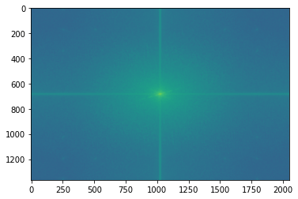

# Plant-Pathology
Experimenting with the Kaggle Plant Pathology Dataset: https://www.kaggle.com/c/plant-pathology-2020-fgvc7

Initial approach:

  I had very limited resources for this project (google colab + my old laptop) therefore I wanted 
  to reduce the computational needs as much as possible, using lots of image processing and trying to 
  find a good performing but still sustainable network architecture.
  
Image processing steps:

  1, Initial image: 
 
 
 
